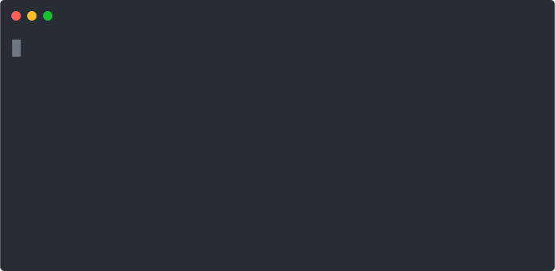

# Website Evidence Collector

The tool *Website Evidence Collector* (WEC) automates the website evidence collection of storage and transfer of personal data. It is based on the browser Chromium/Chrome and its JavaScript software library for automation [puppeteer].

[puppeteer]: https://developers.google.com/web/tools/puppeteer/

## Installation



1. The Website Evidence Collector is a set of scripts written in JavaScript for execution by *Node.js*. Install Node.js and the *Node.js package manager* (NPM). The minimum version for Node.js is 16.0.
  - Windows or Mac: Follow the guide on <https://nodejs.org/en/>.
  - Linux: use the Linux package manager to install Node.js, e.g. `zypper in nodejs10` (check version) or `apt install nodejs`.
2. Install the Website Evidence Collector from
  - the tarball archive file (`*.tar.gz`) downloaded from the [EDPS Website](https://edps.europa.eu/press-publications/edps-inspection-software_en): `npm install --global ./website-evidence-collector-*.tar.gz` (with `*` to be replaced by the current release version),
  - Github with `npm install --global https://github.com/EU-EDPS/website-evidence-collector/tarball/latest`, or
  - Github with `npm install --global https://github.com/EU-EDPS/website-evidence-collector/tarball/master` to get a potentially broken testing version, which includes the latest changes.

The tool can be uninstalled with `npm uninstall --global website-evidence-collector`.

**Hint:** You don't need root permissions for the installation. If you run into permission denied errors during step 2 of the installation try the following commands:

`mkdir "${HOME}/.npm-packages"`  
`npm config set prefix "${HOME}/.npm-packages"`

Now repeat step 2.


## Run Website Evidence Collector


To start the collection for e.g. <https://example.com>, open the terminal and run `website-evidence-collector https://example.com`. The folder `output` contains the gathered evidence.

**Notice on the Processing of Personal Data:** This tool carries out automated processing of data of websites for the purpose of identifying their processing of personal data. If you run the tool to visit web pages containing personal data, this tool will download, display, and store these personal data in the form of text files and screenshots, and you will therefore process personal data.

**Hint:**
If you run into command not found errors you have to add the `.npm-packages` to your `PATH`.  
Run the following commands:

`NPM_PACKAGES="${HOME}/.npm-packages"`  
`export PATH="$PATH:$NPM_PACKAGES/bin"`

You can check your `PATH` with this command: `echo $PATH`.

### Examples with Command Line Options

#### Simple Output on the Terminal only

```sh
website-evidence-collector --no-output --yaml https://example.com 2> /dev/null
```

The last part `2> /dev/null` works on Mac/Linux and redirects the logging output from the screen into a device for disregarding the content.

#### Ignore Certificate Errors during Collection

```sh
website-evidence-collector -y -q https://untrusted-root.badssl.com -- --ignore-certificate-errors
```

All command line arguments after `--` (the second in case of `npm`) are applied to launch Chromium.

Reference: <https://peter.sh/experiments/chromium-command-line-switches/#ignore-certificate-errors>

#### Integrate with testssl.sh

**Note:** [Testssl.sh](https://testssl.sh/) v3.0 or higher must be already installed. The most recent and with WEC tested version is [v3.0.6](https://github.com/drwetter/testssl.sh/releases/tag/v3.0.6).

With the option `--testssl`, the website evidence collector calls `testssl.sh`
to gather information about the HTTPS/SSL connection.

```sh
website-evidence-collector -q --testssl https://example.com
```

The tool assumes the executable `testssl.sh` can be found in the `PATH` variable. The option `--testssl-executable` allows to specify the location and implies the option `testssl`.

```sh
website-evidence-collector -q --testssl-executable ../testssl.sh-3.0.6/testssl.sh https://example.com
```

If `testssl.sh` is called separately, the JSON output file can be integrated subsequently with the option `--testssl-file`.

```sh
website-evidence-collector -q --testssl-file example-testssl.json https://example.com
```

## Frequently Asked Questions

Please find a collection of frequently asked questions with answers in [FAQ.md](FAQ.md)

## Setup of the Development Environment

1. Install the dependencies according to the Installation Guide point 1.
2. Install the version control system *Git* (<https://git-scm.com/>).
3. Download the Website Evidence Collector
  a. from the [EDPS Website](https://edps.europa.eu/press-publications/edps-inspection-software_en) and unpack the received folder with e.g. [7zip](https://www.7-zip.org), or
  b. from Github with `git clone https://github.com/EU-EDPS/website-evidence-collector`.
4. Open the terminal and navigate to the folder `website-evidence-collector`.
5. Install the dependencies using `npm install`
6. Consider to use `npm link` to make the command `website-evidence-collector` outside of the project folder.

## TODO List

- some recorded HTTP cookies have not yet information on their origin (log data)
- fix bugs in HAR creation and verify accuracy, see <https://github.com/Everettss/puppeteer-har/issues> and [New HAR page doesn't appear to be created upon navigation chrome-har#19](https://github.com/sitespeedio/chrome-har/issues/19)
- improve reproducibility by employing only RNG with optionally provided seed, see: [No mechanism to use seeded random generation lodash#3289](https://github.com/lodash/lodash/issues/3289)
- optionally store web pages matching the keywords in markdown format, see <https://justmarkup.com/articles/2019-01-04-using-puppeteer-to-crawl-pages-and-save-them-as-markdown-files/>
- [puppeteer does not fully support PDF and downloads](https://github.com/puppeteer/puppeteer/issues/2794), so that if `--max` is used to browse random links, the script skips links to content with different mime type than `text/html` and scans effectively less pages
- client-side redirects using e.g. `<meta http-equiv="refresh" content="1;URL='https://example.com'"/>` are followed, but not mentioned in the output
- in releases after v1.0.0, the option `--quiet` has no effect any longer – instead debug output is printed to STDERR and can only be disregarded with `2> /dev/null`
- the library `got` does not support the `require()` syntax anylonger since version 12; it seems all use of `require()` must be migrated to `import` for all packages
- the library `puppeteer-har` is basically unmaintained and should be replaced by a fork. https://github.com/auteon/puppeteer-har/ provides a good starting point, but yields an install error as drop-in-replacement

## Third-Party Software

The following software extends WEC to cover further use cases. It is developed independently of the WEC and is not tested or approved by the WEC developers.

- Test Runner to automated Website Evidence Collector for continuous testing <https://github.com/perploug/wec-testrunner>
- A tool to launch website-evidence-collector on several URLs or Sitemaps and generate a full report <https://github.com/ovh/website-evidence-collector-batch>
- A tool that incorporates many ideas of the WEC (but not the WEC itself) to analyse websites <https://github.com/the-markup/blacklight-collector>
- Dashboard to monitor several sites of your organisation for privacy requirements like third parties, cookies and just plain privacy violators <https://github.com/vincentcox/privacy-dashboard>

## Resources for Developers

- puppeteer sandbox online: <https://puppeteersandbox.com/>
- opensource puppeteer sandbox: <https://github.com/ebidel/try-puppeteer>, online at <https://try-puppeteer.appspot.com/>
- puppeteer API documentation: <https://pptr.dev/>
- puppeteer examples: <https://github.com/checkly/puppeteer-examples>
- puppeteer with chrome-as-a-service: <https://github.com/joelgriffith/browserless>
- stacktrace.js documentation: <https://www.stacktracejs.com/#!/docs/stacktrace-js>
- Chrome DevTools Protocol Documentation: <https://chromedevtools.github.io/devtools-protocol/>

## Contributors

- Robert Riemann (European Data Protection Supervisor, initial author)
- Company BitnessWise <https://www.bitnesswise.com/> (code to preset cookies, bug fixes)
- Roland Schilling ([DPA Hamburg](https://datenschutz-hamburg.de/))
- Company Avast <https://www.avast.com> (store page source code in output folder [#68](https://github.com/EU-EDPS/website-evidence-collector/pull/68))
- Per Ploug (Zalando) <https://opensource.zalando.com/> (refactor code base for modularity)

## License

This work, excluding filter lists, is distributed under the European Union Public Licence (the ‘EUPL’). Please find the terms in the file [LICENSE.txt](./LICENSE.txt).

Filter lists in the `assets/` directory are authored by the EasyList authors (<https://easylist.to/>) and are for your convenience distributed together with this work under their respective license as indicated in their file headers.
